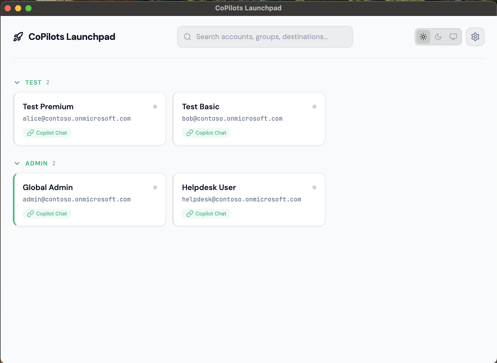
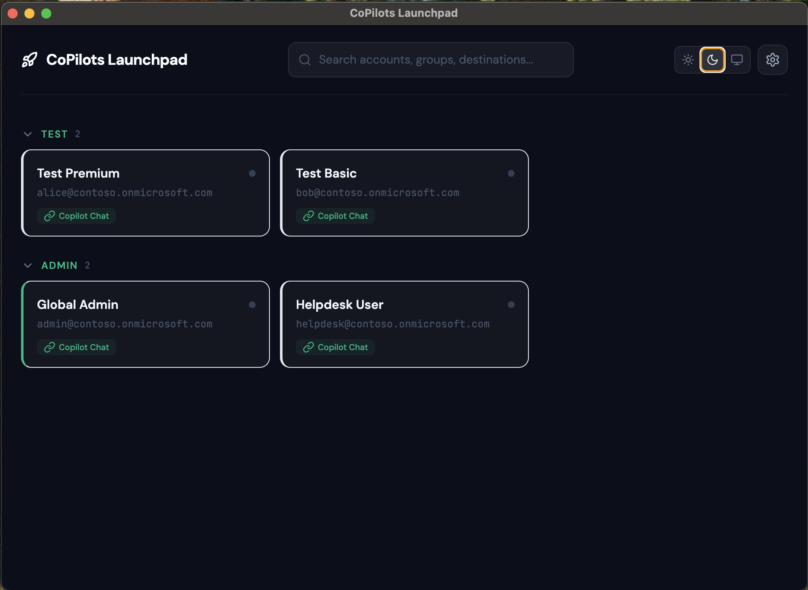
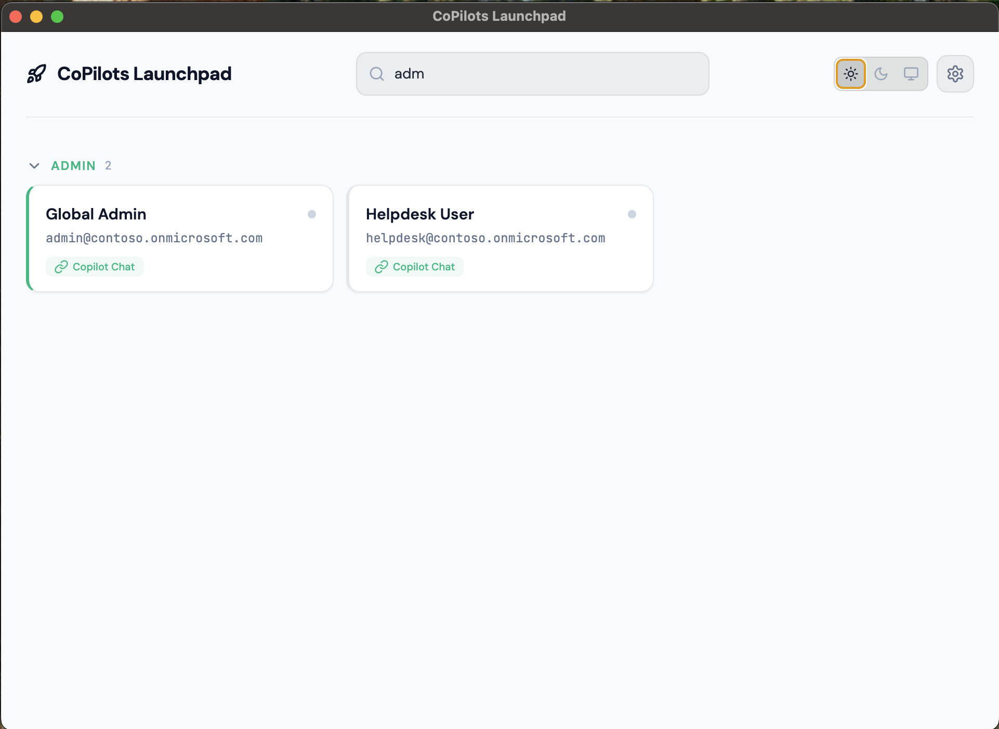
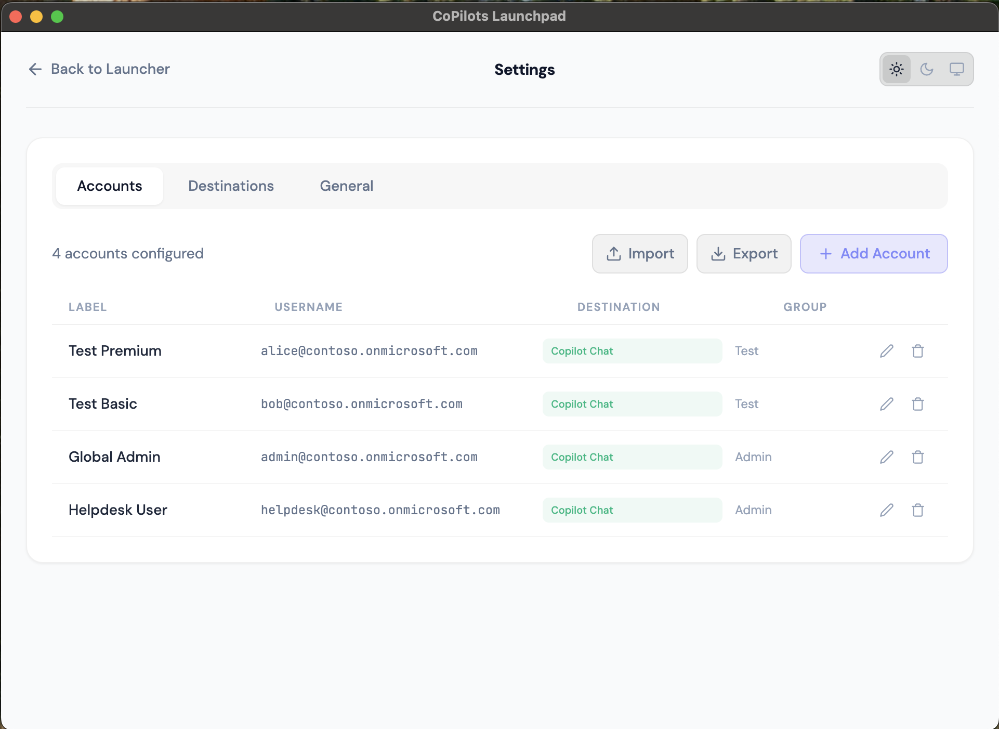
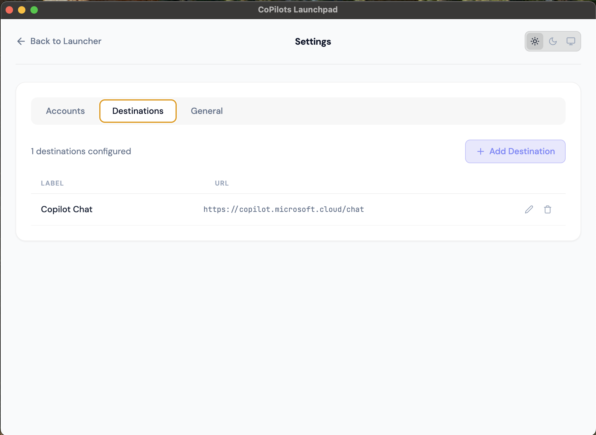
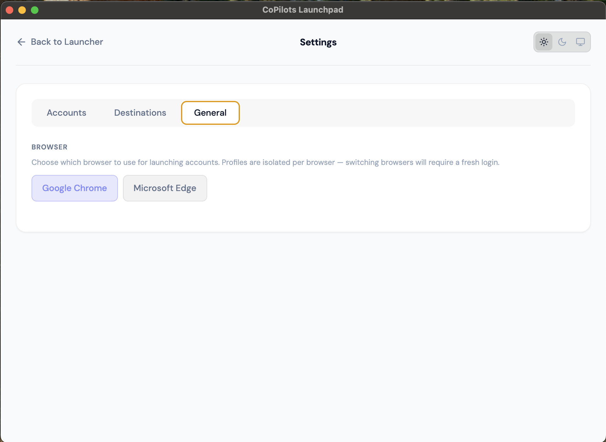
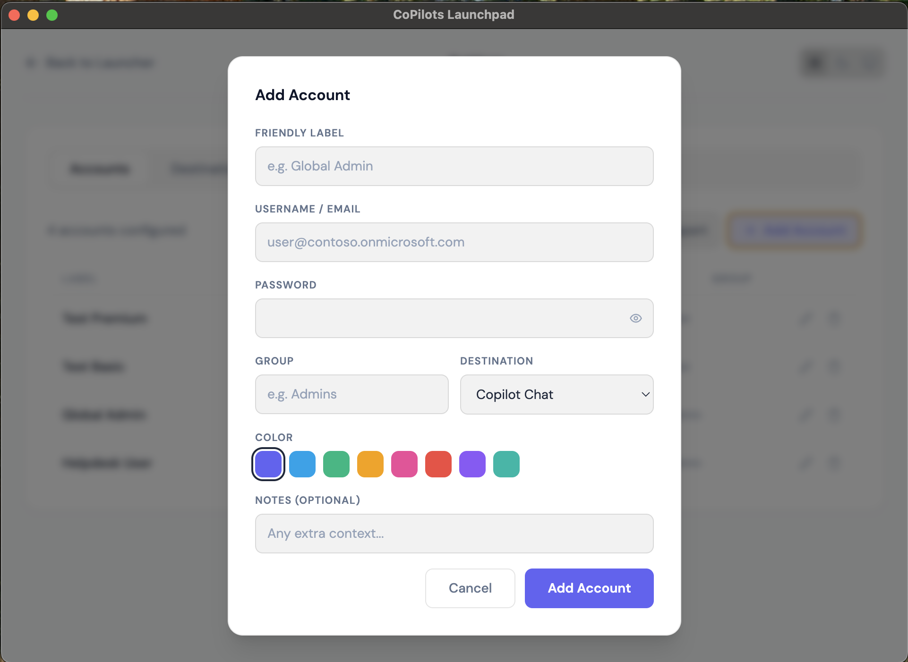
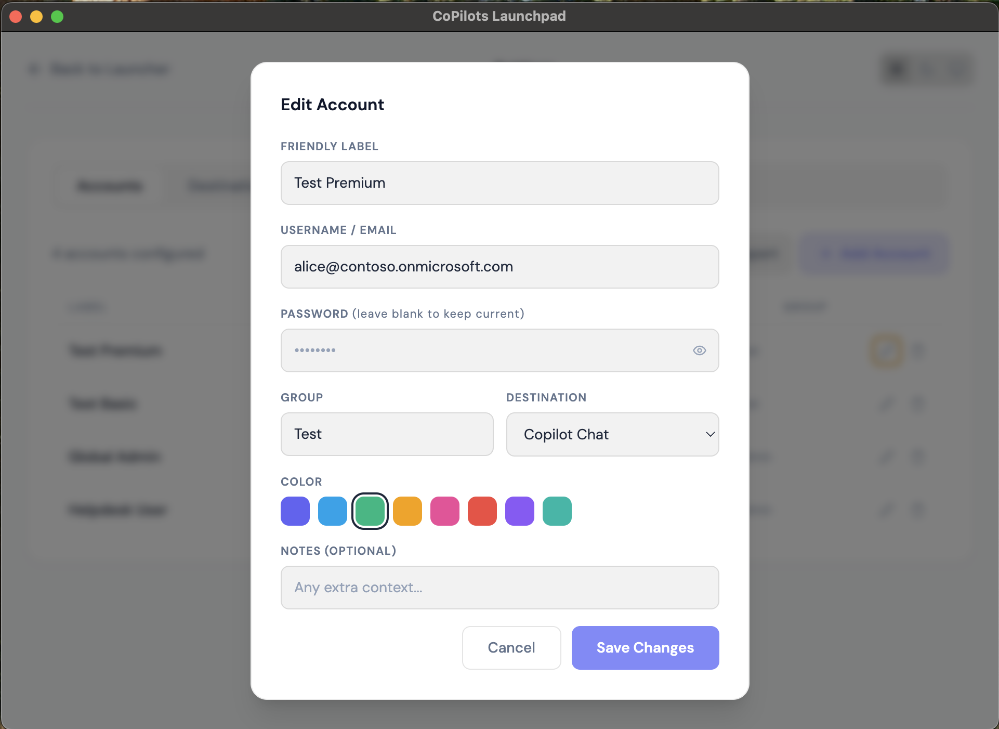
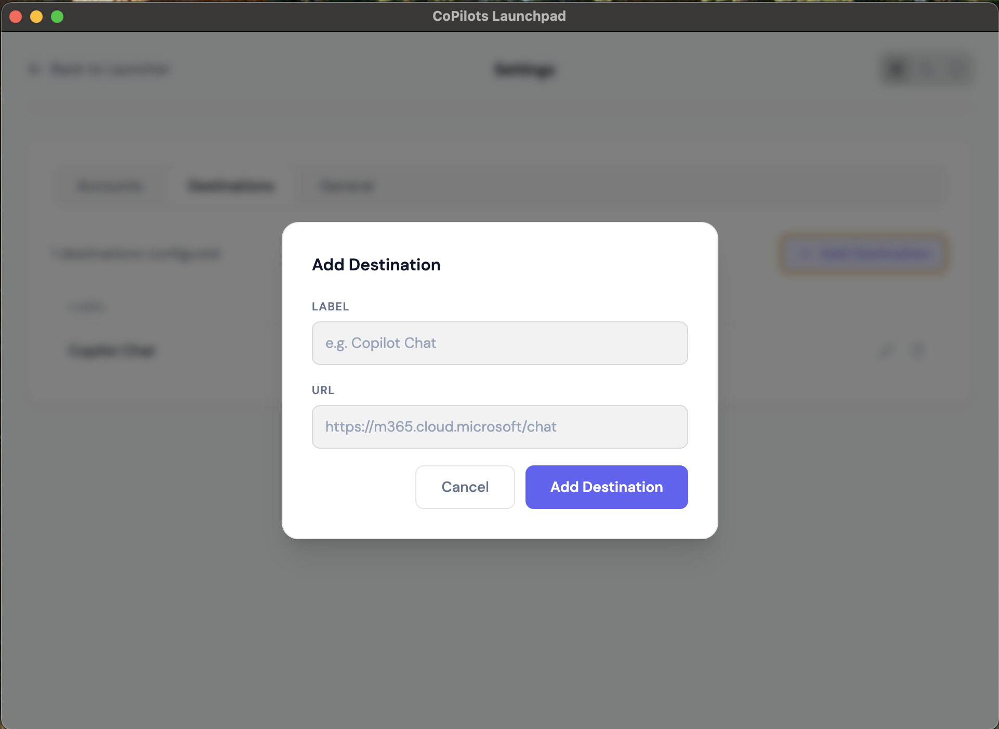

# CoPilots Launchpad

*One click. Browser opens. You're in.*

A lightweight desktop app for managing and launching multiple Microsoft 365 test accounts. Click an account card, the browser opens with auto-login, and you land on Copilot Chat (or any M365 destination). The app sits in the system tray and stays out of the way.


---

## The Problem

You manage ~20 M365 test accounts across different license tiers and roles. Every day you need to log in and out of these accounts repeatedly. Navigating to the login page, entering credentials, handling redirects, clicking "Stay signed in?" — it's tedious and error-prone.

## The Solution

One app. One click. The browser opens, logs in, and lands on the right page.

<details>
<summary><strong>How it works</strong></summary>

1. You click an account card
2. Playwright launches Chrome/Edge with an isolated profile directory
3. Navigates to your configured destination URL
4. Detects the login scenario (already logged in? login form? account picker?)
5. Fills credentials automatically if needed
6. Disconnects — the browser stays open as a normal window
7. Next time, the session may still be valid — instant launch, no login needed

</details>

---

## Features

- **One-click launch** — click a card, browser opens, you're logged in
- **Isolated browser profiles** — each account gets its own sandboxed session via `--user-data-dir`
- **Session persistence** — cookies persist between launches; valid sessions skip login entirely
- **Simultaneous sessions** — multiple accounts open side by side in separate windows
- **Configurable browser** — Google Chrome or Microsoft Edge, switchable in Settings
- **Configurable destinations** — Copilot Chat, M365 Admin Center, or any URL
- **Dark / Light / System theme** — three-way toggle, follows OS preference
- **Grouped accounts** — organize by role, team, or license tier with color-coded groups
- **Search & filter** — find accounts instantly across labels, usernames, groups, and destinations
- **System tray** — close the window, app stays running; click tray icon to reopen
- **CSV import/export** — bulk import accounts from CSV with preview screen, conflict detection, and defaults; export with optional password inclusion
- **Cross-platform** — runs on macOS and Windows
- **Encrypted credentials** — passwords encrypted via OS keychain (Electron safeStorage), never in the renderer process
- **No admin rights** — per-user install, user-writable paths only

---

## Screenshots

### Launcher

| Light | Dark |
|-------|------|
|  |  |

### Search & Filter



### Settings

| Accounts | Destinations | General |
|----------|-------------|---------|
|  |  |  |

### Modals

| Add Account | Edit Account | Add Destination |
|-------------|-------------|-----------------|
|  |  |  |

---

## User Guide

New to the app? See the **[User Guide](docs/user-guide.md)** for step-by-step setup and onboarding instructions.

**CSV Import:** Download the **[sample CSV template](docs/sample-accounts.csv)** to get started with bulk account import.

---

## Quick Start

### Prerequisites

- [Node.js](https://nodejs.org/) 18+
- [Google Chrome](https://www.google.com/chrome/) or [Microsoft Edge](https://www.microsoft.com/edge) installed
- npm (comes with Node.js)

### Development

```bash
git clone https://github.com/nikhilsi/copilots-launchpad.git
cd copilots-launchpad
npm install
npm run dev
```

This starts Vite (React dev server) and Electron concurrently with hot reload.

### Build Installers

```bash
# macOS (.dmg)
npm run dist:mac

# Windows (.exe — NSIS installer)
npm run dist:win
```

Output goes to `dist/`. The Windows build can be cross-compiled from macOS.

---

## Installation (End User)

**macOS:** Open the `.dmg`, drag to Applications.

**Windows:** Run the `.exe` installer — Next, Next, Finish. No admin rights needed (installs to user directory).

**First launch:**
1. App opens to Settings (no accounts yet)
2. Add one or more **destinations** (e.g., "Copilot Chat" → `https://m365.cloud.microsoft/chat`)
3. Add **accounts** with credentials, assign each to a destination
4. Go back to Launcher — click any card to launch

---

## Architecture

```
┌─────────────────────────────────────────────┐
│  Renderer Process (React + Tailwind)        │
│  ┌─────────┐  ┌──────────┐  ┌───────────┐  │
│  │Launcher │  │ Settings │  │  Modals   │  │
│  └────┬────┘  └────┬─────┘  └─────┬─────┘  │
│       │            │              │         │
│       └────────────┼──────────────┘         │
│                    │ IPC (contextBridge)     │
├────────────────────┼────────────────────────┤
│  Main Process      │ (Electron + Node.js)   │
│  ┌─────────┐  ┌────┴─────┐  ┌───────────┐  │
│  │  Tray   │  │IPC Router│  │ Launcher  │  │
│  └─────────┘  └────┬─────┘  │(Playwright)│  │
│                    │        └───────────┘  │
│               ┌────┴─────┐                  │
│               │  Store   │                  │
│               │(encrypted)│                  │
│               └──────────┘                  │
└─────────────────────────────────────────────┘
```

### Tech Stack

| Component | Technology |
|-----------|------------|
| App shell | Electron |
| UI | React + Tailwind CSS |
| Browser automation | playwright-core |
| Credential storage | Electron safeStorage (OS keychain) |
| Data persistence | electron-store |
| Packaging | electron-builder |
| Platforms | macOS, Windows |
| Browsers | Google Chrome, Microsoft Edge |

### Project Structure

```
copilots-launchpad/
├── electron/
│   ├── main.js          # Window, tray, IPC handlers, input validation
│   ├── preload.js       # Context bridge (renderer ↔ main)
│   ├── store.js         # Encrypted CRUD for accounts, destinations, settings
│   └── launcher.js      # Playwright login flow, profile management
├── src/
│   ├── App.jsx          # Root component, view routing
│   ├── pages/           # Launcher, Settings
│   ├── components/      # AccountCard, GroupSection, Modals, ThemeToggle, etc.
│   ├── hooks/           # useAccounts, useDestinations, useTheme
│   └── styles/          # Tailwind imports
├── assets/              # App icons (ico, png, tray)
├── docs/                # Design spec, UI prototype
├── LICENSE              # MIT
├── electron-builder.yml
└── package.json
```

---

## Security

| Concern | Approach |
|---------|----------|
| Credentials at rest | Encrypted via Electron's `safeStorage` API (OS keychain — Keychain on macOS, DPAPI on Windows) |
| Credentials in memory | Passwords never sent to renderer process in list responses; cleared from React state after save |
| IPC boundary | All inputs validated in main process (types, required fields, URL scheme whitelist, color format) |
| Browser profiles | Isolated via `--user-data-dir`; path components sanitized against traversal |
| Content Security Policy | Enforced in production: `script-src 'self'`, `object-src 'none'`, `frame-ancestors 'none'` |
| Electron hardening | `contextIsolation: true`, `nodeIntegration: false`, `sandbox: true` |
| Destination URLs | Must be `http://` or `https://` (blocks `file://`, `javascript:`, etc.) |
| Admin rights | Not required — per-user install, user-writable paths only |

**Important:** This app is designed for **test environments with MFA disabled**. It does not handle MFA prompts.

---

## Browser Profiles

Each account gets its own isolated browser profile directory, namespaced by browser:

```
<app-data>/copilots-launchpad/profiles/
├── chrome/
│   ├── acc-01/    # Chrome session data for account 1
│   └── acc-02/
└── msedge/
    ├── acc-01/    # Edge session data for account 1
    └── acc-02/
```

These are **not** visible in the browser's profile picker. They're invisible sandboxes managed entirely by the app. Switching browsers requires a fresh login (cookies are encrypted per-browser and not portable).

Profiles are created on first launch and deleted when an account is removed (across all browsers).

---

## Login Flow

After navigating to the destination URL, the app detects the scenario via `Promise.race`:

| Scenario | Detection | Action |
|----------|-----------|--------|
| Session alive | Destination UI visible | Done — status turns green |
| Login required | `input[name="loginfmt"]` visible | Fill username → Next → password → Sign In → "Stay signed in?" → Yes |
| Stale session | Account picker visible | Click "Use another account" → fill credentials |

Each step has a 30-second timeout. On failure, the card shows a red error dot.

After login completes, Playwright disconnects. The browser stays open as a normal window under your control.

---

## Configuration

| Setting | Location | Default |
|---------|----------|---------|
| Browser | Settings → General | Chrome (macOS), Edge (Windows) |
| Theme | Toggle in top bar | System |
| Accounts | Settings → Accounts | — |
| Destinations | Settings → Destinations | — |

All settings are stored locally in `<app-data>/copilots-launchpad/config.json`.

---

## Development

```bash
npm run dev          # Start dev server + Electron (hot reload)
npm run build        # Build React production bundle
npm run dist:mac     # Package macOS .dmg
npm run dist:win     # Package Windows .exe (NSIS)
```

**macOS note:** The first time you launch a browser via the app, macOS may ask for Automation permission (System Settings → Privacy & Security → Automation). This is a dev-only concern — packaged apps request their own permission.

---

## License

[MIT](LICENSE)
